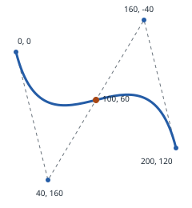

# Getting started

A Bézier curve is defined by its control points. The parameter `t` identifies a
position along the curve: `0` is the start and `1` is the end.

After [installation](installation.md), save this script as `curve.php` beside
`vendor/` and run `php curve.php`. It creates a cubic curve, evaluates its
midpoint, measures its approximate length, and splits it into two curves:

```php
<?php

require __DIR__.'/vendor/autoload.php';

use Alto\Bezier\CubicCurve;
use Alto\Bezier\Point;

$curve = new CubicCurve(
    new Point(0, 0),
    new Point(40, 160),
    new Point(160, -40),
    new Point(200, 120),
);

$midpoint = $curve->pointAt(0.5);
$length = $curve->length(samples: 200);
[$left, $right] = $curve->split(0.5);

echo "Midpoint: {$midpoint}".PHP_EOL;
echo 'Approximate length: '.round($length, 2).PHP_EOL;
echo 'Split joins at: '.$left->pointAt(1).PHP_EOL;
```

The script prints:

```text
Midpoint: (100, 60)
Approximate length: 276.51
Split joins at: (100, 60)
```



The blue curve uses the example's control points; the dashed polygon joins
those controls. The orange point is `pointAt(0.5)`, not the halfway distance.

The split curves meet at the original midpoint. Increasing the sample count
improves the numerical length approximation at the cost of more work.

Next, [choose a curve type](curves.md) or explore the [operations shared
by every curve](operations.md).
